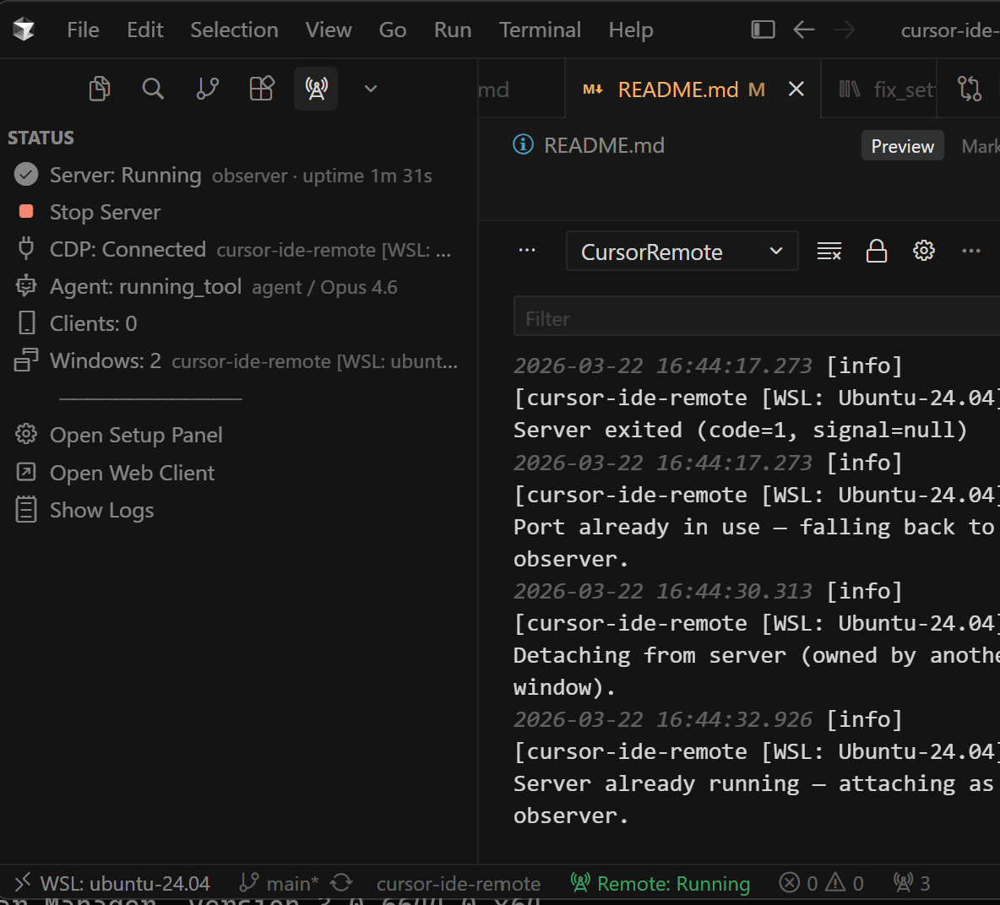

## Chrome DevTools Protocol (CDP)

CursorRemote connects to Cursor's built-in CDP endpoint to observe and interact with the IDE.

### CursorRemote sidebar

Open **CursorRemote** from the activity bar. Use **Start Server** (above) to run the relay; the panel shows CDP connection, agent state, and connected clients:



### Launch Cursor with CDP enabled

**Windows (PowerShell)**
```powershell
& "$env:LOCALAPPDATA\Programs\cursor\Cursor.exe" --remote-debugging-port=9222
```

**macOS**
```bash
open -a "Cursor" --args --remote-debugging-port=9222
```

**Linux**
```bash
cursor --remote-debugging-port=9222
```

Once Cursor is running with CDP, click **Start Server** above — the status bar should turn green.
